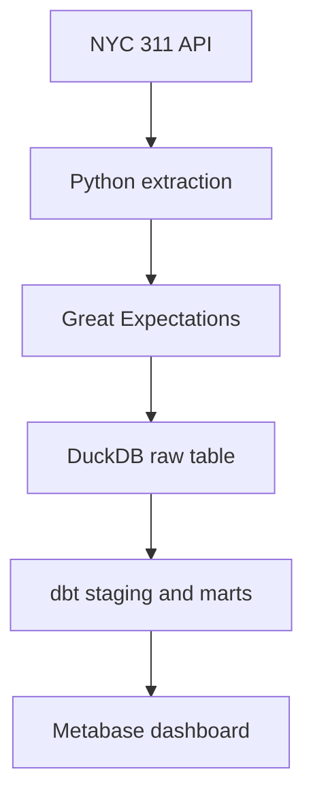
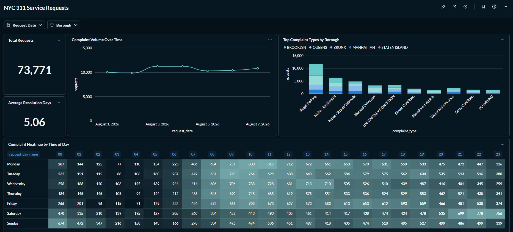

# NYC 311 Analytics Dashboard

An end-to-end analytics project by Davide Cocchia. Python extracts NYC 311 service requests, Great Expectations checks the raw data, DuckDB stores it, dbt builds the analytical models, and Metabase presents an interactive dashboard. A GitHub Actions workflow runs the data refresh automatically.

## Architecture



The local refresh builds a new database before replacing the published file. It validates the data, stops Metabase if running, backs up the previous database, publishes the new file, checks row counts and restarts Metabase. The [architecture notes](docs/architecture.md) explain the backup and rollback behavior.

## Runtime

| Component | Version used |
|---|---|
| Python | 3.13.14 on Windows |
| DuckDB | 1.5.5 |
| dbt Core / dbt-duckdb | 1.12.4 / 1.11.0 |
| Great Expectations | 1.23.0 |
| Metabase / DuckDB driver | 0.63.18 / 1.5.5.0 |

Dependencies are pinned in `requirements.txt`. Python 3.13 is the setup baseline; the installation was verified on Windows. Commands for macOS and Linux are included below but have not been run on those hosts.

## Source and data model

The project uses the [NYC 311 Service Requests dataset](https://data.cityofnewyork.us/d/erm2-nwe9). The extraction window is August 1–7, 2026: `created_date >= 2026-08-01T00:00:00` and `< 2026-08-08T00:00:00`. The API is paginated by creation timestamp and request key, and duplicate keys are rejected during extraction.

| Model | Grain | Purpose |
|---|---|---|
| `raw.nyc_311` | One row per source request | Selected API fields and ingestion metadata |
| `dev_staging.stg_nyc_311` | One row per usable request | Typed timestamps and fields, normalized text, required-field filtering |
| `dev_marts.fct_requests` | One row per request | Dates, geographic indicators, status and resolution metrics |
| `dev_marts.dim_complaint_type` | One row per complaint type | Category lookup with a stable key |

`request_count` is one for every fact row. A valid resolution requires `status = 'CLOSED'`, a closing timestamp and `closed_at >= created_at`. Only these rows have `resolution_hours`; **Average Resolution Days** is `avg(resolution_hours) / 24` over those rows. Open requests and invalid intervals are excluded from that average, but remain in the fact table.

`has_valid_borough` recognizes Bronx, Brooklyn, Manhattan, Queens and Staten Island. `has_valid_coordinates` checks an approximate NYC rectangle: latitude 40.4–41.0 and longitude −74.3–−73.6. It does not verify that a point falls within official city boundaries. Missing and unrecognized geographic values receive a false indicator.

## Verified results

The September 25, 2026 local refresh produced:

| Check | Result |
|---|---:|
| Raw, staging and fact requests | 73,771 each |
| Distinct complaint types | 154 |
| Recognized borough | 73,695 |
| Unspecified borough | 76 |
| Coordinates in the approximate NYC rectangle | 72,404 |
| Missing coordinates | 1,367 |
| Present coordinates outside the rectangle | 0 |
| dbt build | 20 passed, 0 warnings, 0 errors |

The API can update existing service requests, so counts and resolution times can change on later runs even when the date window stays fixed.

## Metabase dashboard

The local **NYC 311 Service Requests** dashboard has five views:

1. **Total Requests** — count of service requests.
2. **Average Resolution Days** — mean closing interval for valid closed requests.
3. **Complaint Volume Over Time** — request volume by creation date.
4. **Top Complaint Types by Borough** — stacked category counts by borough.
5. **Complaint Heatmap by Time of Day** — colored table of weekday and hour counts.



Dashboard filters cover **Request Date** and **Borough**. The [dashboard guide](docs/dashboard-guide.md) explains their interpretation and the metric definitions.

The dashboard, saved questions and filter connections currently exist in the local Metabase application volume. They are not recreated by cloning the repository; their definitions still need to be exported and added. The analytical models and dashboard behavior were verified on the local instance.

## Getting started

### Prerequisites

- Git and Python 3.13.
- Docker with Compose for Metabase.
- Internet access to download dependencies, build the Metabase image and query the NYC 311 API.

Run these commands from the repository root. On **Windows PowerShell**:

```powershell
git clone https://github.com/Davideco89/analytics-dashboard.git
cd analytics-dashboard
.\setup.bat
.\.venv\Scripts\Activate.ps1
docker compose build metabase
python scripts/update_data.py
docker compose up -d --wait metabase
```

On **macOS or Linux**, with `python3.13` available:

```bash
git clone https://github.com/Davideco89/analytics-dashboard.git
cd analytics-dashboard
./setup.sh
source .venv/bin/activate
docker compose build metabase
python scripts/update_data.py
docker compose up -d --wait metabase
```

Both setup scripts create `.venv`, copy `.env.example` to `.env` only if needed, install dependencies, run the environment and offline Python tests, and check the Compose configuration. They do not download NYC data, build the Metabase image or start a container; the remaining commands do those jobs explicitly. An existing virtual environment with a Python version other than 3.13 causes setup to stop rather than replacing it.

Open [http://localhost:3000](http://localhost:3000) and add a DuckDB database with file path `/home/metabase/data/analytics.duckdb`. Compose mounts the analytical database directory read-only inside Metabase and exposes port 3000 only on localhost. Saved Metabase configuration uses a separate Docker volume; do not remove that volume when stopping the project.

## Validation and updates

Run the offline Python tests from the repository root:

```bash
python -m unittest discover -s tests/python -v
```

For a new local snapshot, with the virtual environment active:

```bash
python scripts/update_data.py
```

The refresh runs seven Great Expectations checks and `dbt build` (three models and 17 dbt tests), creates a database backup when replacing an existing database, and verifies raw, staging and fact row counts after publication. A lock prevents concurrent local refresh processes.

The [GitHub Actions workflow](.github/workflows/update-data.yml) runs weekly in headless mode and uploads the generated CSV, database and dbt artifacts. Its result is a separate runner artifact: the workflow does not replace the database in the local Metabase instance. The configured date window is fixed, so weekly runs update the same week's snapshot rather than append new weeks.

## Implementation decisions

| Decision | Reason |
|---|---|
| dbt staging view and materialized marts | Keep cleaning and analytical measures in separately testable layers |
| Full replacement of a fixed date window | Capture corrections to existing requests without duplicate append behavior |
| Staged database and backup before publication | Keep the previous analytical database available if a refresh fails |
| Separate Metabase application volume | Preserve dashboard definitions across container restarts |
| Great Expectations plus dbt tests | Validate the incoming file and the transformed models at different stages |

The repository excludes local credentials, virtual environments, generated CSV and DuckDB files, backups, and Metabase application state. A metadata export is still needed to make the saved dashboard portable.

## Troubleshooting

### `python` is not recognized in PowerShell

Windows may expose Python through `py` rather than `python`. Create the environment with `py -3.13 -m venv .venv`, activate it with `.\.venv\Scripts\Activate.ps1`, then check `python --version` and `python -c "import sys; print(sys.executable)"`. The interpreter should be Python 3.13 inside the project's `.venv`.

### A Metabase Request Date filter shows no results

The source covers only August 1–7, 2026. Check that the selected date falls in this range. If you recreated a saved question, also check that the dashboard filter is mapped to the fact's `request_date` field.

## Credits and acknowledgements

- **DataSkew** — [End-to-End Analytics Platform with DuckDB + Metabase](https://dataskew.io/projects/analytics-dashboard/) supplied the project brief and learning objectives. The implementation in this repository was built independently by Davide Cocchia.
- **NYC Open Data / NYC311** — [311 Service Requests from 2020 to Present](https://data.cityofnewyork.us/d/erm2-nwe9) provides the source records analyzed in this project.
- **DuckDB, dbt, Great Expectations and Metabase** — open-source tools used for storage, modeling, validation and visualization.

Attribution does not imply endorsement by the credited projects or data provider.
