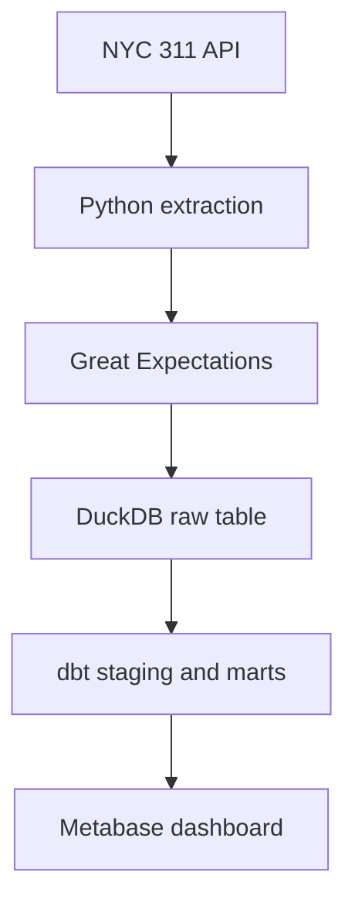
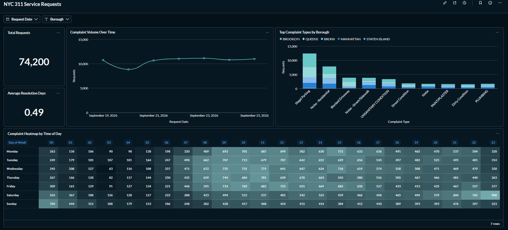

# NYC 311 Analytics Dashboard

An end-to-end analytics project by Davide Cocchia. Python extracts NYC 311 service requests, Great Expectations checks the raw data, DuckDB stores it, dbt builds the analytical models, and Metabase presents an interactive dashboard. A GitHub Actions workflow runs the data refresh automatically.

## Architecture


```mermaid
flowchart TD
    A["NYC 311 API"] --> B["Python extraction"]
    B --> C["Great Expectations"]
    C --> D["DuckDB raw table"]
    D --> E["dbt staging and marts"]
    E --> F["Metabase dashboard"]
```

The local refresh builds a new database before replacing the published file. It validates the data, stops Metabase if running, backs up the previous database, publishes the new file, checks row counts and restarts Metabase. The [architecture notes](docs/architecture.md) explain the backup and rollback behavior.

## Runtime

| Component | Version used |
|---|---|
| Python | 3.13.14 on Windows |
| DuckDB | 1.5.5 |
| dbt Core / dbt-duckdb | 1.12.4 / 1.11.0 |
| Great Expectations | 1.23.0 |
| Metabase / DuckDB driver | 0.63.18 / 1.5.5.0 |

Dependencies are pinned in `requirements.txt`. Python 3.13 is the setup baseline; the installation was verified on Windows. Commands for macOS and Linux are included below but have not been run on those hosts.

## Source and data model

The project uses the [NYC 311 Service Requests dataset](https://data.cityofnewyork.us/d/erm2-nwe9). By default each refresh replaces the snapshot with the **latest seven New York calendar days after a one-day source-delivery buffer**: `created_date >= start` and `< end`, where `end` is midnight at the start of yesterday in New York. A run on Sunday September 27, 2026 selects September 19 through September 25; the following Sunday selects September 26 through October 2. The source had published only 534 records through 02:06 on September 26 when checked on September 27, so treating the previous calendar day as complete created a false drop in the chart. `NYC_311_WINDOW_DAYS` changes the lookback (for example, `14`); `NYC_311_SOURCE_LAG_DAYS` changes the buffer (default `1`). Extraction rejects an evidently truncated final day before publishing any file: the latest event must reach 23:00 local time and its daily count must be at least one quarter of the median preceding daily count. This is a safeguard, not a guarantee of final source completeness. The API is paginated by creation timestamp and request key, and duplicate keys are rejected during extraction. Timestamps in the source and date overrides are treated as New York local time.

| Model | Grain | Purpose |
|---|---|---|
| `raw.nyc_311` | One row per source request | Selected API fields and ingestion metadata |
| `dev_staging.stg_nyc_311` | One row per usable request | Typed timestamps and fields, normalized text, required-field filtering |
| `dev_marts.fct_requests` | One row per request | Dates, geographic indicators, status and resolution metrics |
| `dev_marts.dim_complaint_type` | One row per complaint type | Category lookup with a stable key |

`request_count` is one for every fact row. A valid resolution requires `status = 'CLOSED'`, a closing timestamp and `closed_at >= created_at`. Only these rows have `resolution_hours`; **Average Resolution Days** is `avg(resolution_hours) / 24` over those rows. Open requests and invalid intervals are excluded from that average, but remain in the fact table.

`has_valid_borough` recognizes Bronx, Brooklyn, Manhattan, Queens and Staten Island. `has_valid_coordinates` checks an approximate NYC rectangle: latitude 40.4–41.0 and longitude −74.3–−73.6. It does not verify that a point falls within official city boundaries. Missing and unrecognized geographic values receive a false indicator.

## Verified results

The September 25, 2026 **historical August 1–7 window** refresh produced:

| Check | Result |
|---|---:|
| Raw, staging and fact requests | 73,771 each |
| Distinct complaint types | 154 |
| Recognized borough | 73,695 |
| Unspecified borough | 76 |
| Coordinates in the approximate NYC rectangle | 72,404 |
| Missing coordinates | 1,367 |
| Present coordinates outside the rectangle | 0 |
| dbt build | 20 passed, 0 warnings, 0 errors |

The screenshot and these counts document the historical baseline, not expected values for a fresh rolling run. The API can revise existing requests; a rolling refresh also advances the reporting dates, so totals and resolution times will change.

## Metabase dashboard

The local **NYC 311 Service Requests** dashboard has five views:

1. **Total Requests** — count of service requests.
2. **Average Resolution Days** — mean closing interval for valid closed requests.
3. **Complaint Volume Over Time** — request volume by creation date.
4. **Top Complaint Types by Borough** — stacked category counts by borough.
5. **Complaint Heatmap by Time of Day** — colored table of weekday and hour counts.



Dashboard filters cover **Request Date** and **Borough**. The [dashboard guide](docs/dashboard-guide.md) links to five versioned SQL files in `dashboard/sql/` and provides the dimension join, visualization settings, filter connections, and complete query text needed to recreate the dashboard.

The saved dashboard lives in the local Metabase application volume, which persists across container restarts. A fresh clone rebuilds the analytical data, then the [dashboard guide](docs/dashboard-guide.md) lets you recreate the five questions and their shared filters without that volume. The screenshot documents an earlier August window and will differ from new snapshots.

## Getting started

### Prerequisites

- Git and Python 3.13.
- Docker with Compose for Metabase.
- Internet access to download dependencies, build the Metabase image and query the NYC 311 API.

Run these commands from the repository root. On **Windows PowerShell**:

```powershell
git clone https://github.com/Davideco89/analytics-dashboard.git
cd analytics-dashboard
.\setup.bat
.\.venv\Scripts\Activate.ps1
docker compose build metabase
python scripts/update_data.py
docker compose up -d --wait metabase
```

On **macOS or Linux**, with `python3.13` available:

```bash
git clone https://github.com/Davideco89/analytics-dashboard.git
cd analytics-dashboard
./setup.sh
source .venv/bin/activate
docker compose build metabase
python scripts/update_data.py
docker compose up -d --wait metabase
```

Both setup scripts create `.venv`, copy `.env.example` to `.env` only if needed, install dependencies, run the environment and offline Python tests, and check the Compose configuration. They do not download NYC data, build the Metabase image or start a container; the remaining commands do those jobs explicitly. An existing virtual environment with a Python version other than 3.13 causes setup to stop rather than replacing it. The `tzdata` dependency supplies the New York time zone on systems without a system time zone database, including Windows.

Open [http://localhost:3000](http://localhost:3000) and add a DuckDB database with file path `/home/metabase/data/analytics.duckdb`. Compose mounts the analytical database directory read-only inside Metabase and exposes port 3000 only on localhost. Saved Metabase configuration uses a separate Docker volume; do not remove that volume when stopping the project.

## Validation and updates

Run the offline Python tests from the repository root:

```bash
python -m unittest discover -s tests/python -v
```

For a new local snapshot, with the virtual environment active:

```bash
python scripts/update_data.py
```

The refresh runs seven Great Expectations checks and `dbt build` (three models and 17 dbt tests), creates a database backup when replacing an existing database, and verifies raw, staging and fact row counts after publication. A lock prevents concurrent local refresh processes.

**Existing clones:** setup scripts never overwrite `.env`. If it still contains `NYC_311_START_DATE=2026-08-01T00:00:00` and `NYC_311_END_DATE=2026-08-08T00:00:00`, remove or comment out **both** lines; also change `NYC_311_MIN_ROWS` to `1000` and `NYC_311_MAX_ROWS` to `250000`. `NYC_311_SOURCE_LAG_DAYS` defaults to `1` even when omitted from an older `.env`. Check the extraction log for the selected window. For a deliberate historical replay, set **both** date overrides to New York local timestamps; either override alone fails. The default bounds are broad sanity checks for a seven-day slice, not fixed expected counts; adjust them after examining a different window or a changed source. The live database is fully rebuilt, so it contains the current window rather than appended history.

The [GitHub Actions workflow](.github/workflows/update-data.yml) runs Sundays at 16:00 UTC (after the observed source delivery delay) in headless mode and uploads the generated CSV, database and dbt artifacts. Each run selects the latest seven buffered New York days and fails rather than publishing an obviously partial final day. Its result is a separate runner artifact: the workflow does not replace the database in your local Metabase instance. Run `python scripts/update_data.py` locally to update the dashboard you see on your machine.

## Implementation decisions

| Decision | Reason |
|---|---|
| dbt staging view and materialized marts | Keep cleaning and analytical measures in separately testable layers |
| Full replacement of a rolling date window | Include new days and corrections to recent requests without duplicate append behavior |
| Staged database and backup before publication | Keep the previous analytical database available if a refresh fails |
| Separate Metabase application volume | Preserve dashboard definitions across container restarts |
| Great Expectations plus dbt tests | Validate the incoming file and the transformed models at different stages |

The repository excludes local credentials, virtual environments, generated CSV and DuckDB files, backups, and Metabase application state. Metabase Open Source does not include the serialization feature for exporting and importing saved dashboards; the versioned SQL files and guide contain the queries and filter wiring needed to rebuild the delivered dashboard.

## Troubleshooting

### `python` is not recognized in PowerShell

Windows may expose Python through `py` rather than `python`. Create the environment with `py -3.13 -m venv .venv`, activate it with `.\.venv\Scripts\Activate.ps1`, then check `python --version` and `python -c "import sys; print(sys.executable)"`. The interpreter should be Python 3.13 inside the project's `.venv`.

### A Metabase Request Date filter shows no results

Check the selected extraction window in the latest refresh log; a rolling run replaces the previous week. For a recreated question, map the dashboard filter to the fact's `request_date` field as described in the [dashboard guide](docs/dashboard-guide.md). An old `.env` with both August date overrides will keep selecting that historical week until you remove them.

## Credits and acknowledgements

- **DataSkew** — [End-to-End Analytics Platform with DuckDB + Metabase](https://dataskew.io/projects/analytics-dashboard/) supplied the project brief and learning objectives. The implementation in this repository was built independently by Davide Cocchia.
- **NYC Open Data / NYC311** — [311 Service Requests from 2020 to Present](https://data.cityofnewyork.us/d/erm2-nwe9) provides the source records analyzed in this project.
- **DuckDB, dbt, Great Expectations and Metabase** — open-source tools used for storage, modeling, validation and visualization.

Attribution does not imply endorsement by the credited projects or data provider.
