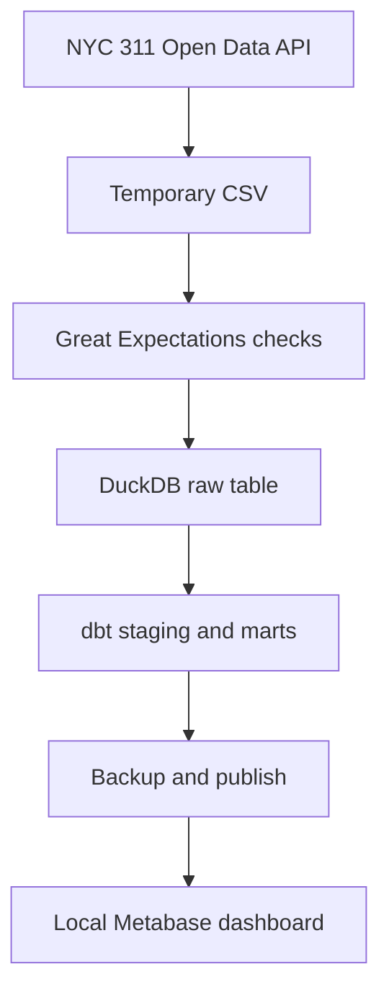

# Architecture and refresh behavior

`scripts/update_data.py` builds a complete replacement for the configured date window in a staging DuckDB database. Extraction and dbt validation happen before the live file is replaced. A backup of the previous analytical database is placed in `data/backups/` before publication; publication errors restore the previous database when a backup exists. If Metabase is running, the script stops it before replacement and restarts it afterward, waiting for its health check. The raw CSV is published after database validation.

The lock at `data/database/.refresh.lock` prevents concurrent local runs. The Actions job sets `METABASE_MODE=headless` and validates only the generated analytical database. It uploads artifacts for inspection; there is no deployment path from the runner to the local Docker volume or DuckDB file.

The Metabase application database is a **separate** state store in the Docker volume `analytics-dashboard_metabase_state`. The DuckDB backups do not back up saved questions, dashboards, users, or permissions. To preserve those Metabase objects, export their metadata or make a separate backup of the application volume. Do not publish a raw application-state backup: it may contain sensitive account information.

The configured extraction window is fixed to the first week of August 2026. A scheduled refresh can capture corrections to those records but will not extend the reporting period until the configuration and raw-data row-count bounds are reviewed and changed.
