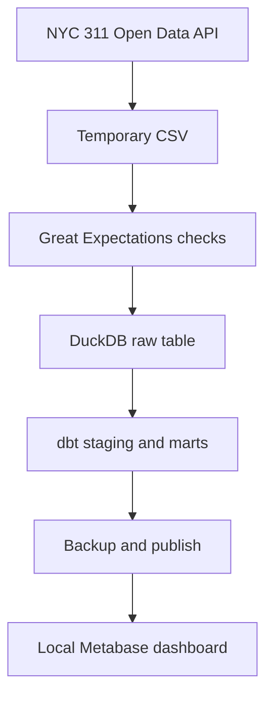

# Architecture and refresh behavior

```mermaid
flowchart TD
    API["NYC 311 Open Data API"] --> CSV["Temporary CSV"]
    CSV --> GX["Great Expectations checks"]
    GX --> RAW["DuckDB raw table"]
    RAW --> DBT["dbt staging and marts"]
    DBT --> PUBLISH["Backup and publish"]
    PUBLISH --> MB["Local Metabase dashboard"]
```

`scripts/update_data.py` builds a complete replacement for the configured date window in a staging DuckDB database. Extraction and dbt validation happen before the live file is replaced. A backup of the previous analytical database is placed in `data/backups/` before publication; publication errors restore the previous database when a backup exists. If Metabase is running, the script stops it before replacement and restarts it afterward, waiting for its health check. The raw CSV is published after database validation.

The lock at `data/database/.refresh.lock` prevents concurrent local runs. The Actions job sets `METABASE_MODE=headless` and validates only the generated analytical database. It uploads artifacts for inspection; there is no deployment path from the runner to the local Docker volume or DuckDB file.

The Metabase application database is a **separate** state store in the Docker volume `analytics-dashboard_metabase_state`. The DuckDB backups do not back up saved questions, dashboards, users, or permissions. Preserve those objects by backing up the application volume separately. Do not publish a raw application-state backup: it may contain sensitive account information.

By default the extraction window contains seven New York calendar days ending before a one-day source-delivery buffer. On September 27 the source had published requests only through 02:06 on September 26, making that day unsuitable for a daily comparison. Before the temporary CSV replaces the current file, extraction checks that the selected final day reaches 23:00 and has at least 25% of the median count of preceding days. A failure preserves the previous published snapshot. The weekly schedule runs at 16:00 UTC Sunday to give the source more time to settle; delayed publication can still cause a failed run instead of a misleading chart. Each build replaces the previous week's snapshot, retaining corrections to the dates in its current window but not accumulating older history. Two explicit date overrides allow historical replay; existing `.env` files with old overrides must be edited to enable rolling updates. The snapshot count bounds can be tuned to the source's recent volume.
